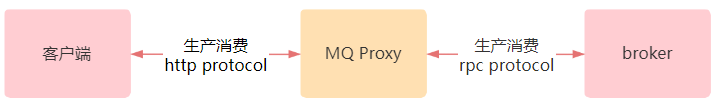

## MQ-Proxy - 基于HTTP协议的[RocketMQ](https://github.com/apache/rocketmq)客户端代理服务
**它具备以下特性：**

* 支持http协议的消息生产。

* 支持http协议的消息集群模式消费和广播模式消费。

* 支持消费堆积监控预警，借助于[MQCloud](https://github.com/sohutv/mqcloud)实现。

* 支持消费限速，暂停，偏移量重置，消息重发等功能。

* 安全：写操作均在[MQCloud](https://github.com/sohutv/mqcloud)进行操作，然后通知MQ-Proxy，防止篡改。

* 下图简单描述了MQ-Proxy核心定位：

  

**为什么要支持http协议？**

* RocketMQ客户端的逻辑复杂，通信为私有协议。
* 非java语言的客户端由社区提供，更新不及时，bug较多，兼容性不好。
* 非java语言客户端若出现生产消费问题，需要精通此种语言和RocketMQ原理的人，成本高昂。
* 某些语言没有相应的RocketMQ客户端。

基于以上种种问题，MQ-Proxy采用了通用的http协议，实现了生产消费代理服务。

**快速接入之消息生产**

下面举一个jquery的例子，来展示一下如何基于http协议进行消息生产：

```
<script>
    var param = {
        producer: "mqcloud-http-test-topic-producer"
    };

    function httpProduce() {
        param.message = "http生产测试";
        $.ajax({
            type: "POST",
            url: "http://127.0.0.1:8082/mq/produce",
            data: param,
            success: function (data) {
                console.log(data)
                if (data.status == 200) {
                    console.log("send ok")
                } else {
                    // 重试发送
                    httpProduce()
                }
            }, error: function (XmlHttpRequest, textStatus, errorThrown) {
                console.error(textStatus)
                // 重试发送
                setTimeout("httpProduce()", 1000);
            }
        });
    }

    httpProduce()
</script>
```

**快速接入之集群消费**

```
<script>
    var param = {
        topic: "mqcloud-json-test-topic",
        consumer: "http-clustering-consumer"
    };

    function httpConsume() {
        $.ajax({
            type: "GET",
            url: "http://127.0.0.1:8081/mq/message",
            data: param,
            success: function (data) {
                if (data.status == 200) {
                    param.requestId = data.result.requestId;
                    if (data.result.msgListSize > 0) {
                        console.log(data.result.status + "," + data.result.msgListSize);
                    }
                    if (data.result.retryMsgListSize > 0) {
                    	console.log(data.result.retryMsgListSize);
                    }
                } else {
                    console.log(data.message);
                }
                interval = setTimeout("httpConsume()", 1000);
            }, error: function (XmlHttpRequest, textStatus, errorThrown) {
                console.error(textStatus)
                interval = setTimeout("httpConsume()", 1000);
            }
        });
    }
    httpConsume();
</script>
```

接口说明及更多使用方式请参考MQCloud的http协议生产消费的[使用说明](https://github.com/sohutv/mqcloud/blob/master/mq-cloud/src/main/resources/static/wiki/userGuide/http.md)。

注意：MQ-Proxy依赖于MQCloud，使用前请先搭建好MQCloud环境。

